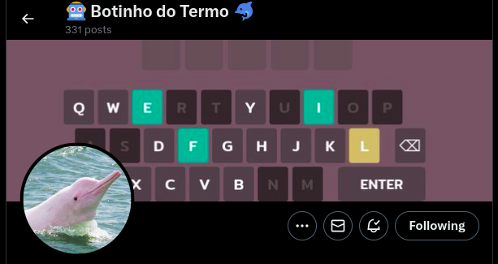

[luizamaral306@gmail.com](luizamaral306@gmail.com)

# Hi there 👋

## 🚀 About Me

🎓 I'm **Luiz**, a **Data Scientist** and **Developer**. My fascination with code started way back, and over 10 years I've honed my skills in building and maintaining vision-based sensor systems. But my true passion lies in the exciting world where AI meets the physical realm.

🏆 When I need a mental challenge, I turn to the world of competitive programming and Capture the Flag (CTF) competitions. The thrill of solving problems under pressure and the camaraderie of the competitive coding community really energize me.

👨‍💻 Beyond the code, I'm a firm believer in the power of open-source communities. Contributing to open-source projects in Python, Rust, Elixir, Ruby and JavaScript fuels my fire (I've even got packages published in some of them!). You might also find my tinkering on projects for Google, MDN, and scikit-learn – or maybe somewhere else in the vast GitHub universe.

When I'm not elbow-deep in code, you'll likely find me:

- ⛰️ Exploring the outdoors: Nature is my happy place, and there's nothing quite like a good hike or adventure to clear my head and spark new ideas.

- 🍔 Whipping up delicious meals: Food is more than just sustenance – it's an experience! I love experimenting in the kitchen and sharing my culinary creations with friends and family.

- ✈️ Venturing off on new travel adventures: The world is a vast and exciting place, and I'm always eager to explore new cultures, landscapes, and experiences.

- 🏃🏻‍♂️ Enjoying a good challenge: running offers a chance to truly push me forward. Each stride pushes me past my perceived limits. Every run is a battle, a test of my will, leaving me exhilarated by the victories I achieve.

<a href="https://www.linkedin.com/in/luiz-nishino-amaral/" target="blank">Let's chat! Contact me at </a>

 
 
 
 

## Games Almost From Scratch

A long term project of mine is rebuilding games without any game engine. Here's the ones I made so far:

  

    

      <a href="https://luxedo.github.io/minesweeper-almost-from-scratch/">
        <b>Minesweeper</b>
        
      </a>
    

    

      <a href="https://tetris-almost-from-scratch.firebaseapp.com/">
        <b>Tetris</b>
        
      </a>
    

    

      <a href="https://asteroids-almost-from-scratch.herokuapp.com/">
        <b>Asteroids</b>
        
      </a>
    

  

  

    

      <a href="https://luxedo.github.io/pong-almost-from-scratch/">
        <b>Pong</b>
        
      </a>
    

    

      <a href="https://luxedo.github.io/spacewar-almost-from-scratch/">
        <b>Spacewar!</b>
        
      </a>
    

    

      <a href="https://luxedo.github.io/hamurabi-almost-from-scratch/">
        <b>Hamurabi</b>
        
      </a>
    

  

 
 
 
 

## Projects

Sometimes I get some ideas in my mind that I have to put it into code. It happens that I have many of those projects
and you can check them in the projects tab above. Feel free to check the sample ones below:

  <a href="https://pypi.org/project/esb/">
    <h3>ElfScript Brigade</h3>
    
  </a>

For the past years I've participated in the [Advent of Code](https://adventofcode.com/) challenges.
I join the advent mainly to maintain my coding sharpness and also to learn a new programming language.
_ElfScript Brigade_ is a tool to help the development of solutions in any programming language.
Check it's usage in my [AoC Solutions repository](https://github.com/luxedo/advent-of-code).

  <a href="https://smarty-bird.firebaseapp.com/">
    <h3>Smarty Bird</h3>
    
  </a>

 
My wife wanted to learn some pixelart and we came up with the idea of copying [Flappy Bird](https://en.wikipedia.org/wiki/Flappy_Bird).
Of course, it couldn't be just a copy, so we decided to add a genetic algorithm training mode to see the game play itself.

  <a href="https://smarty-bird.firebaseapp.com/">
    <h3>Botinho do Termo</h3>
    
  </a>

 
When the Brazilian version of [Wordle](https://en.wikipedia.org/wiki/Wordle), named [Termo](https://term.ooo/) got popular, 
I was the first developer to build an automatic solver and posted the solutions daily on Twitter.

 
 
 
 

## Open Source Libraries

One of my joys is to build a tool that is useful for myself and then take an extra step to publish it for everyone to use.
I have published several libraries and each one of them has helped me acomplish something:

> #### [🍓📸 Picamip](https://pypi.org/project/picamip/)
>
> Python simple Raspberry-Pi camera module web interface

> #### [💊🔴 OCDots](https://luxedo.github.io/OCDots/)
>
> OCDots is a javascript library for creating evenly distributed points inside a polygon with simple charge physics

> #### [🔥🗺️ @luxedo/heatmap](https://www.npmjs.com/package/@luxedo/heatmap)
>
> Node package for heatmap image generation based on kernel density estimation

> #### [📦📡 python-SPOS](https://pypi.org/project/spos/)
>
> #### [📦📡 node-SPOS](https://www.npmjs.com/package/spos)
>
> SPOS is a specification to declare small binary payloads.
> There's implementations for Python and Node

> #### [🍓⚡ Fake RPI GPIO](https://pypi.org/project/fakeRPiGPIO/)
>
> This package is used to simulate the RPi.GPIO module. This package only contains the functions in the RPi.GPIO package without the functionality.

> #### [🍓📼 MCP 3008](https://pypi.org/project/mcp3008/)
>
> RPi_mcp3008 is a python library to listen to the MCP3008 A/D converter chip with a RPi

> #### [🍓🤖 RPi stepper](https://pypi.org/project/RPistepper/)
>
> A python library to control stepper motors with the ULN2803A controller

> #### [📍☁️ spiky-clouds](https://www.npmjs.com/package/spiky-clouds)
>
> This is a filter that converts images into spiky images. The image is created by drawing needles instead o pixels for each pixel value.

> #### [🌹</> prettycode](https://www.npmjs.com/package/prettycode)
>
> prettycode is a software to pretty print code into a pdf file. This was my very first node package I published

<!-- ==================STYLES===================== -->

